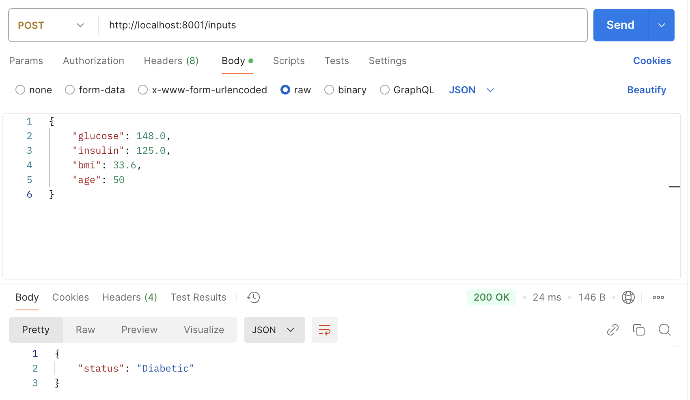

# Objective

Turn a binary classifier (**XG Boost**) to predict diabetes into a Machine Learning solution

Dataset source: [Diabetes Dataset on Kaggle](https://www.kaggle.com/datasets/mathchi/diabetes-data-set)

# Architecting the solution

The solution is intended to use a Machine Learning model to power a web application and is architected in two stages - i) model pipeline, ii) integrating into a website


<h4 style="text-align: center;">Figure1: Solution architecture</h4>

## Model pipeline
A three task strategy

<h4 style="text-align: center;">Table1: model deployment pipeline</h4>

| S. No. | Task | Purpose | Tech |
| ------ | ---- | ------- | ---- |
| 1 | API | Model processes a request and sends a response | FastAPI |
| 2 | Containerization | wrapper that captures all dependencies | Docker |
| 3 | Deployment | run the container over a server or cloud provider | AWS ECS |

Steps associated with the model deployment pipeline:

1. Create RestAPI to recieve parameters and return the predictions
2. Containerize the API into a [Docker image](https://fastapi.tiangolo.com/deployment/docker/) and push to Docker hub
3. Deploy the container on AWS ECS and expose an endpoint

### Executing FastAPI

API details

1. method: POST
2. endpoint: `/inputs`
3. body: glucose (float), insulin (float), bmi (float), age (int)
4. response: dict {"status": "diabetic/undiabetic"}

Follow the steps below to create and execute the RestAPI on your local server and the [Postman Desktop Client](https://learning.postman.com/docs/getting-started/first-steps/get-postman/). 

1. `cd app`
2. `pip install -r requirements.txt`
3. `python3 -m uvicorn main:app --host 127.0.0.1 --port 8001 --reload`

<div align="center">



</div>

<h4 style="text-align: center;">Figure2: API execution results</h4>

4. exit Uvicorn server once everything is working and build Docker image
    
    a. `cd ..`
    
    b. `docker build -t <image_name> .`

5. run the docker image, `docker run -d --name <container_name> -p 80:80 <image_name>`

6. create a repository on [docker hub](https://hub.docker.com) and push the image

    a. `docker tag <image_name> <repository-name>`

    b. `docker push <repository-name>`

7. query the endpoint on Postman

<div align="center">


</div>

<h4 style="text-align: center;">Figure3: executing Docker image endpoint on Postman</h4>

<div align="center">
<br>


</div>

<h4 style="text-align: center;">Figure4: Docker image execution status</h4>

### Deployment


## Website Integration

Create a simple website in JavaScript fetauring a submit button to receeive 4 inputs (**features**). Integrate the ``fetch`` function to send a POST request at the endpoint hosted on ECS.

```
apiUrl = <url for aws ecs cluster>
const response = await fetch(apiUrl, {
    method: "POST",
    headers: {"Content-Type": "application/json"},
    body: JSON.stringify({
        glucose: float(input1),
        insulin: float(input2),
        bmi: float(input3),
        age: int(input4)
    })
})
```

**Note**: to execute POST requests with FastAPI enable CORSMiddleware

### On a side note: an alternate approach

Creating a website in JavaScript and integrating the ML classifier can be avoided by using **no-code** alternatives such as [Gradio](https://www.gradio.app). As a no-code platform it creates an API to access the model from an iteractive UI. This allows one to access the model directly as a pickle file which helps avoid both containerization and deployment.

This implementation can be found in `gradio.py`. Steps to execute on Gradio

1. `pip install gradio==3.36.1`
2. `python3 gradio.py`

**Note**: FastAPI is a Gradio dependency. An error may arise due to version conflict between both of them. Just search for the correct versions and install them.
